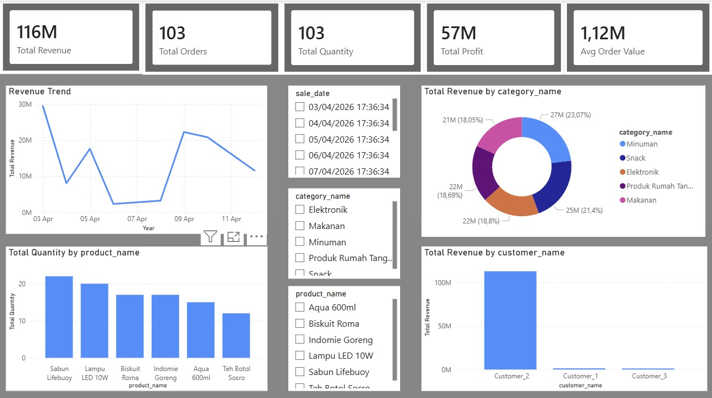
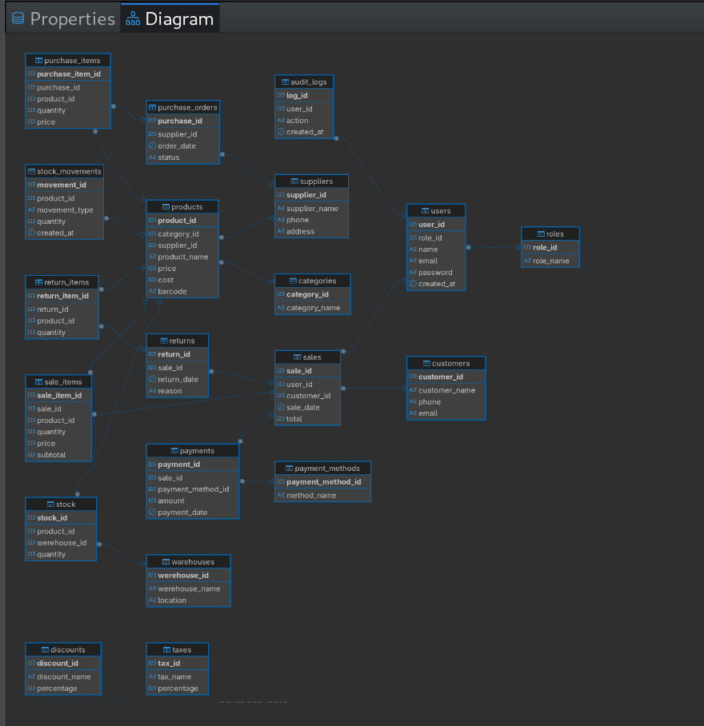

# POS Sales Analytics Dashboard

## Dashboard Preview

## Project Overview

Project ini bertujuan untuk menganalisis data transaksi dari sistem **Point of Sale (POS)** dan membangun dashboard interaktif menggunakan Microsoft Power BI. Analisis ini membantu memahami performa penjualan, tren transaksi, kontribusi kategori produk, serta perilaku pelanggan.

Dalam project ini, data disiapkan menggunakan SQL kemudian divisualisasikan dalam bentuk dashboard interaktif untuk menghasilkan insight bisnis yang lebih mudah dipahami.

# Project Workflow

Project ini dilakukan melalui beberapa tahapan utama:

1. Database Design menggunakan SQL
2. Data Preparation dan Export Data
3. Data Modeling di Power BI
4. Data Visualization dan Dashboard Development
5. Insight Analysis

# 1. Database Design (SQL)

Database POS dibuat menggunakan SQL untuk menyimpan data transaksi penjualan. Struktur database dirancang menggunakan konsep **relational database** agar data dapat dianalisis secara efisien.

Tabel yang dibuat:

**categories**

* category_id
* category_name

**products**

* product_id
* category_id
* product_name
* price
* cost
* barcode

**customers**

* customer_id
* customer_name

**sales**

* sale_id
* customer_id
* sale_date
* total

**sale_items**

* sale_item_id
* sale_id
* product_id
* quantity
* price

Relasi antar tabel dirancang untuk menggambarkan hubungan antara produk, kategori, pelanggan, dan transaksi penjualan.

Contoh relasi utama:

categories → products
products → sale_items
sales → sale_items
customers → sales

Struktur ini memungkinkan analisis seperti:

* revenue per kategori
* produk paling laku
* kontribusi pelanggan terhadap penjualan

# 2. Data Preparation

Setelah database dibuat, data transaksi dimasukkan ke dalam tabel menggunakan SQL.

Data kemudian diekspor menjadi beberapa file CSV agar dapat diolah di Power BI.

File yang dihasilkan:

* categories.csv
* products.csv
* customers.csv
* sales.csv
* sale_items.csv

Dataset ini kemudian digunakan sebagai sumber data untuk proses analisis selanjutnya.

# 3. Data Modeling in Power BI

Data dari file CSV diimpor ke Microsoft Power BI untuk proses analisis dan visualisasi.

Langkah yang dilakukan:

* Import dataset ke Power BI
* Membersihkan dan menyesuaikan tipe data
* Membuat relasi antar tabel
* Membuat measure untuk analisis KPI

Relationship yang digunakan:

categories.category_id → products.category_id
products.product_id → sale_items.product_id
sales.sale_id → sale_items.sale_id
customers.customer_id → sales.customer_id

Struktur ini membentuk model data yang memungkinkan analisis multi dimensi seperti kategori, produk, dan pelanggan.

# 4. Key Metrics (DAX Measures)

Beberapa metrik utama dibuat menggunakan DAX untuk menghitung performa penjualan.

Total Revenue
Total nilai penjualan dari seluruh transaksi.

Total Orders
Jumlah transaksi yang terjadi.

Total Quantity
Jumlah total produk yang terjual.

Average Order Value
Rata-rata nilai transaksi pelanggan.

Metrik ini digunakan sebagai indikator utama performa bisnis.

# 5. Dashboard Visualization

Dashboard dibuat menggunakan Microsoft Power BI untuk menampilkan hasil analisis secara visual dan interaktif.

Visualisasi yang digunakan:

**KPI Cards**
Menampilkan metrik utama seperti:

* Total Revenue
* Total Orders
* Total Quantity
* Average Order Value

**Revenue Trend**
Line chart yang menunjukkan tren penjualan dari waktu ke waktu.

**Revenue by Category**
Donut chart yang memperlihatkan kontribusi setiap kategori terhadap total revenue.

**Product Sales Analysis**
Bar chart yang menunjukkan jumlah produk yang terjual berdasarkan product name.

**Customer Revenue**
Bar chart yang menunjukkan kontribusi revenue dari masing-masing pelanggan.

---

# 6. Interactive Filters

Dashboard juga dilengkapi dengan beberapa filter untuk eksplorasi data:

* Filter berdasarkan tanggal transaksi
* Filter kategori produk
* Filter nama produk

Filter ini memungkinkan pengguna untuk melakukan eksplorasi data secara lebih fleksibel.

# 7. Key Insights

Beberapa insight yang dapat diperoleh dari dashboard ini antara lain:

* Total revenue mencapai lebih dari 100 juta dari lebih dari 100 transaksi.
* Kategori produk memberikan kontribusi yang berbeda terhadap total penjualan.
* Beberapa produk memiliki jumlah penjualan yang jauh lebih tinggi dibanding produk lainnya.
* Sebagian besar revenue berasal dari pelanggan tertentu.

Insight ini dapat membantu pemilik bisnis dalam memahami performa penjualan dan menentukan strategi bisnis.

# Tools Used

DBeaver (MySQL)
Microsoft Power BI Desktop
CSV Dataset

# Conclusion

Project ini menunjukkan bagaimana data transaksi dari sistem POS dapat diolah menjadi dashboard analitik yang memberikan insight bisnis yang berguna.

Melalui proses database design, data preparation, data modeling, dan visualization, data yang awalnya berupa tabel transaksi dapat diubah menjadi informasi yang mudah dipahami dan digunakan dalam pengambilan keputusan.

Project ini juga menjadi latihan dalam membangun workflow analisis data end-to-end mulai dari pengolahan data hingga visualisasi dashboard.

# Author

Muhammad Atha Ramadhana
Computer Engineering Undergraduate
Interested in Data Science, Machine Learning, and AI
